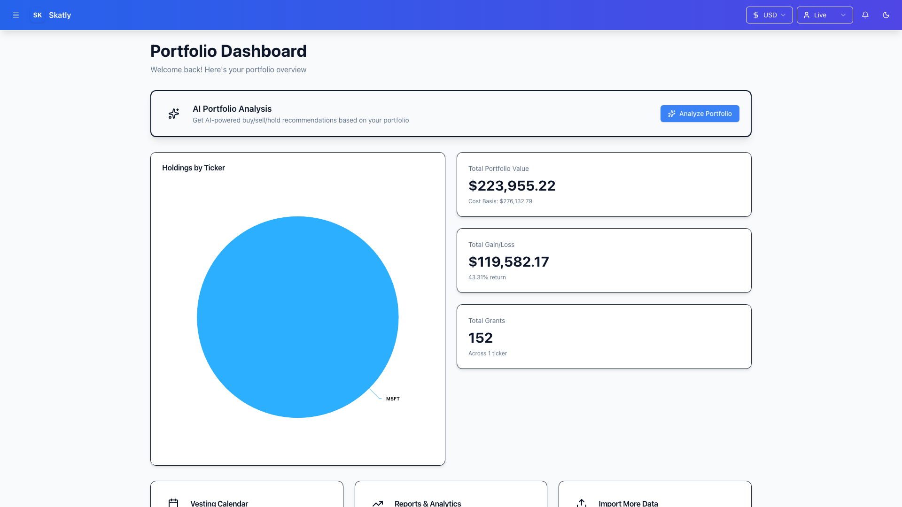
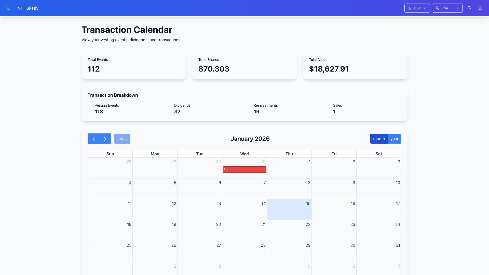
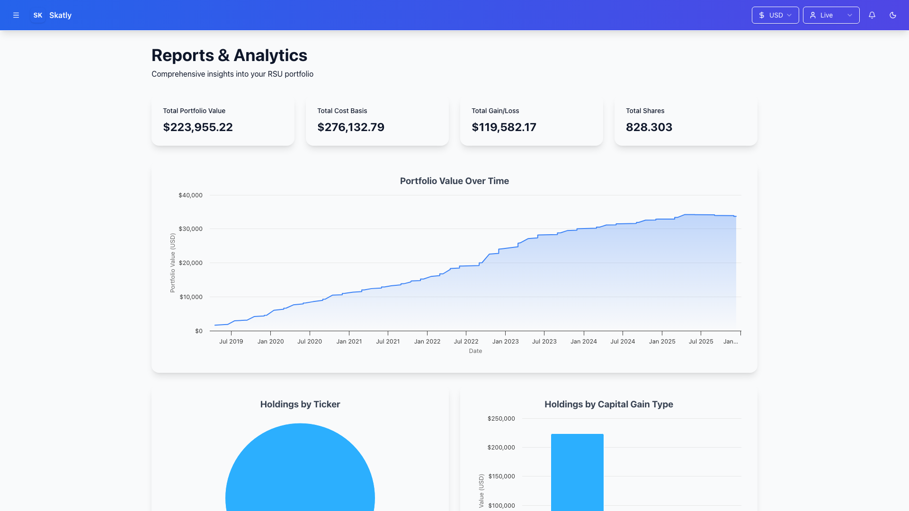
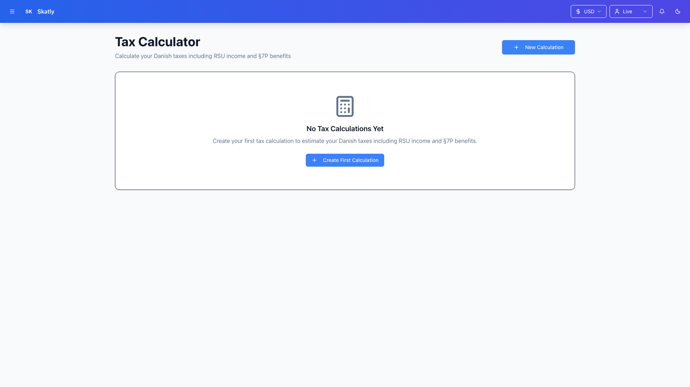
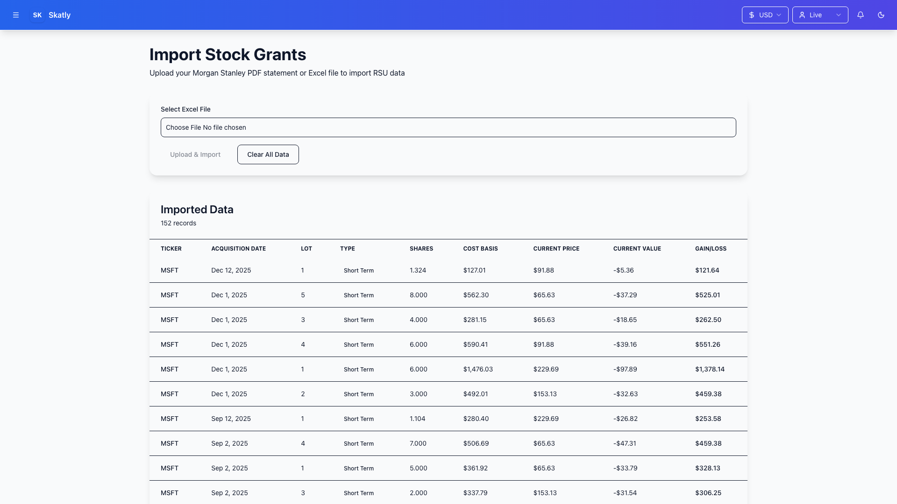
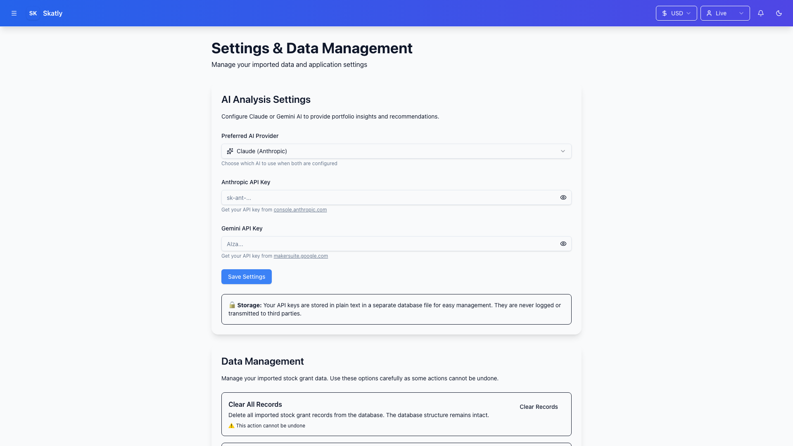

# Skatly - Danish Tax & RSU Manager

A Next.js application built with Bun to help manage taxes and RSU (Restricted Stock Unit) stock grants in Denmark, particularly for employees of tech companies.

## Screenshots

<details>
<summary>Click to view application screenshots</summary>

### Dashboard


### Calendar View


### Reports & Analytics


### Tax Calculator


### Import Data


### Settings


</details>

## Features

- **RSU Tracking**: Monitor vesting schedules and track your RSU grants
- **Tax Calculation**: Calculate Danish taxes on stock compensation and capital gains
- **SKAT Integration**: Generate reports ready for Danish Tax Authority filing
- **AI Portfolio Analysis**: Get AI-powered buy/sell/hold recommendations (Claude & Gemini)
- **Multi-Currency**: Display values in USD or DKK with real-time conversion
- **Analytics**: Comprehensive charts and reports
- **Dark Mode**: Full theme support with persistence

## Quick Start (Docker)

The easiest way to run Skatly:

```bash
# Clone the repository
git clone <repository-url>
cd finance-manager

# Start with Docker Compose
docker-compose up -d
```

The application will be available at [http://localhost:3000](http://localhost:3000).

**Data Persistence**: Your data is automatically persisted in the `./data` directory, even if you stop or remove the container.

**Managing the Container**:
```bash
# View logs
docker-compose logs -f

# Stop the application
docker-compose down

# Restart
docker-compose restart

# Rebuild after code changes
docker-compose up -d --build
```

## Alternative: Local Development

For development without Docker:

```bash
cd src
bun install
bun dev
```

See [Getting Started with Development](docs/getting-started-development.md) for detailed setup instructions.

## Documentation

Detailed guides for development and configuration:

- **[Getting Started with Development](docs/getting-started-development.md)** - Local development setup, project structure, testing, API endpoints, and troubleshooting
- **[Configure LLM](docs/configure-llm.md)** - Set up Claude or Gemini AI for portfolio analysis and recommendations

## Tech Stack

- **Framework**: Next.js 16 with App Router (Turbopack)
- **Runtime**: Bun
- **Language**: TypeScript
- **Styling**: Tailwind CSS 4 with shadcn/ui
- **State**: Zustand
- **Database**: SQLite (bun:sqlite)
- **Charts**: Highcharts
- **AI**: Claude (Anthropic) & Gemini (Google)

## Danish Tax Context

This application is specifically designed for the Danish tax system:

- **Ligningslov § 28**: Stock options and RSUs taxed as personal income at vesting
- **Ligningslov § 7P**: Special RSU taxation regime with potential tax benefits
- **Aktieindkomst**: Taxation of dividends and capital gains
- **SKAT Reporting**: Annual reporting requirements for foreign stock holdings

## Contributing

Contributions and suggestions are welcome. For development setup, see the [development guide](docs/getting-started-development.md).

## License

Private project for personal use.

## Support

For questions or issues:
- Check the [development guide](docs/getting-started-development.md) for technical details
- Check the [LLM configuration guide](docs/configure-llm.md) for AI setup
- Create an issue in the repository
